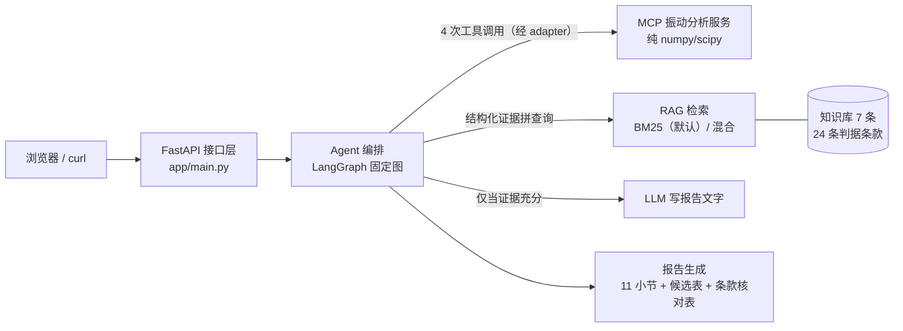
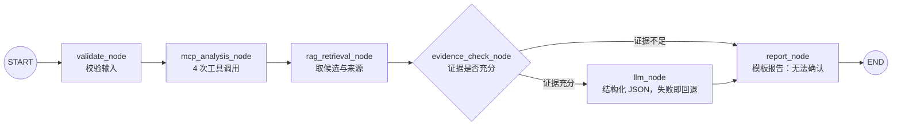

# 工业设备故障诊断 Agent 工作台

> 以「正常 / 异常两段振动信号对比」为入口，把**信号算法 → MCP 工具契约 → RAG 条款检索 → LangGraph 编排 → 可追溯报告**整条链路打通的故障诊断 Agent：MCP 只算信号证据、RAG 只给候选与来源、Agent 只做编排、LLM 只负责把证据写成报告文字。

[](https://www.python.org/)
[](docs/evaluation.md)
[](docs/architecture.md)
[](https://github.com/langchain-ai/langgraph)
[](https://fastapi.tiangolo.com/)

## 背景与定位

上一份工作中，我总结梳理了部门的设备数据分析流程：拿到正常 / 异常两段数据后，逐项计算特征、翻查标准与历史经验条目、比对判断，最后整理成分析报告。这些环节重复、耗时，结论也难追溯。

于是我把这套流程固化成固定步骤（数据校验 → 特征提取 → 正常 / 异常对比 → 判据核对 → 报告输出），并做成这个 Agent 工作台来提效：信号计算交给 MCP 工具、判据与来源交给 RAG、执行顺序交给 LangGraph、模型只负责把证据写成报告文字——每次诊断的节点、工具调用与依据都留痕可查。

当前范围与边界：

- 在 **CWRU 公开数据的一个工况**上完成全链路验证（12 kHz 驱动端、0 hp、1797 rpm、单点加速度计，每个样本 1 秒 / 12000 点），内置 **5 个样例**；文中所有结果均为实测记录，不对其他工况外推准确率。
- 输出属于工程辅助建议：结论附数据证据与知识来源，最终判断仍需现场复测、拆检与专业人员确认。

## 这个项目做了什么

| 亮点 | 说明 |
|---|---|
| **固定图编排，不做开放式循环** | LangGraph 6 节点固定流程 + 条件分支（下图为完整路径）。MCP 工具只能由一个节点经适配层调用，`MAX_TOOL_CALLS` 封顶，一次诊断固定 4 次工具调用；节点访问顺序写进 `trace.nodes`，可回归测试 |
| **证据分层，各层不越权** | MCP 只算信号证据、RAG 只给候选与来源、模型只负责把结构化证据写成文字、报告由确定性代码生成；模型严禁引入候选之外的故障类型 |
| **条款级判据核对** | 7 条知识条目带 **24 条具名判据条款**（受控词表：15 个指标 × 6 个比较符，不做字符串求值）；确定性核对引擎逐条给出 **hit / miss / unknown**，算判据因子并按 `alignment_score = 检索分 × 因子` 重排候选；证据冲突时不下硬结论（`review` 告警 + 置信度强制 low + 人工复核建议） |
| **全链路降级** | 无 Key → 模板报告；无 embedding / 索引不可用 → BM25 并记录降级原因；模型超时 / 非 JSON / 候选外类型 → `template_fallback`，报告字段结构不变 |
| **双后端一致** | `local`（进程内）与 `mcp:stdio`（真实 MCP 子进程）下同一诊断的结论、候选、分数、来源逐字段一致，差异只有耗时 |
| **实时时间线 + 会话可追问** | SSE 推送真实节点 / 工具事件（前端零模拟）；每次诊断落盘 SQLite 可回看，支持 7 个固定问题的受控追问与「限制在本次会话事实内」的自由问答，无依据时明确拒答 |
| **138 个测试** | 单元 / 端到端 / 接口 / SSE / 会话 / 序列 / 条款核对全覆盖，含 7 个真实端到端场景 |

## 架构



一次诊断的执行路径（固定边 + 唯一条件分支；校验或工具阶段出错即结束，`report=null`）：



| 层 | 只做什么 | 明确不做什么 |
|---|---|---|
| MCP 振动分析（`app/mcp/`） | 读 CSV、数据校验、时域/频域特征、包络解调、按几何换算 BPFO/BPFI/BSF/FTF、正常-异常对比；纯 `numpy/scipy`，无网络依赖，同输入必得同输出 | 不给故障名称、不检索知识、不调模型 |
| MCP 适配层（`app/mcp/adapter.py`） | 对上层暴露 3 个固定契约函数，屏蔽 `local` / `mcp:stdio` 差异，统一信封，失败转结构化错误且绝不抛异常 | 不做信号计算、不改写工具返回的数据 |
| RAG（`app/rag/`） | 知识条目（含来源、定位与判据条款）加载、BM25 检索（可评估后启用混合）、条款核对与候选重排 | 不做信号计算、不判定故障、不生成报告文本 |
| Agent 编排（`app/agent/graph.py`） | 固定图决定工具调用顺序与次数、组装上下文、判断证据充分性、决定走模型还是模板、冲突守卫 | 不自己算特征、不造故障类型（只能从候选里选）、不自己核对判据 |
| LLM（`app/agent/llm_client.py`） | 兼容 OpenAI 协议；超时 / 重试 / 异常归一为 `LLMError`；无 Key 即跳过 | 不做信号计算、不决定流程、不产出报告结构 |
| 报告（`app/agent/report.py`） | 确定性生成 11 小节报告，区分「数据事实 / 知识依据 / 推断结论」，含候选表与条款核对表 | 不新增知识库外的故障类型、不算任何数值 |
| FastAPI（`app/main.py`） | 接口、SSE 事件流、会话落盘、追问 / 自由问答、波形音频端点，转发编排层 | 不参与信号分析、检索与结论生成 |

完整的职责边界表、失败处理顺序、双后端切换机制与包络解调原理见 [`docs/architecture.md`](docs/architecture.md)。

## 快速开始

**无需任何 API Key 即可完整运行**：默认 `MCP_MODE=local` + BM25 检索 + 模板报告，全程不联网、不调模型。实测环境：Windows / Python 3.12.10。

```powershell
# 1. 创建虚拟环境并安装依赖（在项目根目录执行）
py -3.12 -m venv .venv
& ".\.venv\Scripts\python.exe" -m pip install -r requirements.txt

# 2. 启动服务（首次运行无需 .env）
& ".\.venv\Scripts\python.exe" -m uvicorn app.main:app --host 127.0.0.1 --port 8000

# 3. 浏览器打开工作台页面
#    http://127.0.0.1:8000/
```

打开页面后，在「分析输入」选择内置样例（自动带出采样率 / 转速等工况），点「开始分析」即可看到：6 节点执行时间线、4 次工具调用明细、条款核对表与 11 小节报告。

> 若 `python` 不在 PATH，用上面命令里的 `py -3.12` 或 venv 内的解释器即可。
> 接入真实模型是可选项：`Copy-Item .env.example .env` 后填 `MODEL_API_BASE` / `MODEL_API_KEY`，配置 `USE_LLM=auto`。

## 内置样例与实测结果

内置 5 个样例（`data/samples/`），覆盖正常、内圈、外圈、滚动体、损坏样本五类。不配模型 Key（模板报告，`llm_mode=template`）时的真实实测：

| 基线 vs 异常 | `status` | 实测结果 |
|---|---|---|
| `normal_1797` vs `inner_race_1797` | `ok` | top1 `inner_race_fault`，score 0.4453，条款核对 **6/6 命中** |
| `normal_1797` vs `outer_race_1797` | `ok` | top1 `outer_race_fault`，score 0.4412，条款核对 **6/6 命中** |
| `normal_1797` vs `ball_1797` | `ok` | top1 `ball_fault`，score **0.6283**，条款核对 5/5 命中，置信度 **low**（BPFI / BSF 族能量并列，见「已知边界」） |
| `normal_1797` vs `normal_1797` | `insufficient_evidence` | 无显著变化被拦截，`candidates` / `sources` 均为空，报告输出「无法确认」 |
| `normal_1797` vs `corrupted_1797` | `error` | `missing_value` 在数据校验阶段即停机，只调用 1 次工具，`report=null` |

真实生成的报告原文见 [`docs/example_report.md`](docs/example_report.md)；七个端到端场景（含模型超时回退）的逐项实测见 [`docs/evaluation.md`](docs/evaluation.md)。

## 接口速查

| 接口 | 说明 |
|---|---|
| `GET /health` | 服务状态：`mcp_backend` / `llm_available` / `retrieval_mode` / `sample_count` |
| `GET /api/samples` | 内置样例清单（只含 id、文件名与工况元数据） |
| `POST /api/diagnose` | 核心诊断。`multipart/form-data`：上传 CSV 或选内置样例，返回完整结构化结果（数据质量 / 特征 / 候选 / 报告 / trace） |
| `POST /api/diagnose/stream` | 同参数，SSE 实时推送 9 类执行事件（节点 / 工具 / 分支 / 告警），响应头带 `X-Session-Id` |
| `GET /api/sessions` | 历史会话列表（摘要） |
| `GET /api/sessions/{id}` | 单个会话完整记录（结果 + 事件 + 对话，前端据此重放） |
| `POST /api/sessions/{id}/ask` | 受控追问：仅 7 个固定问题，后端确定性拼装，不调模型 |
| `POST /api/sessions/{id}/chat` | 自由问答：模型生成但限制在会话事实内，回答需过关键词 / 链接两道校验，不合格降级为确定性回答 |
| `GET /api/sessions/{id}/audio/{slot}.wav` | 原始波形试听（`normal` / `abnormal`），旁挂文件按需懒加载 |

**判定口径**：业务失败与「证据不足」的 HTTP 状态仍是 200，看响应体的 `status`（`ok` / `insufficient_evidence` / `error`）；接口层错误统一返回 `{"detail": {code, message}}`（400 / 413 / 422 / 500）。完整字段、事件信封与错误码见 [`docs/architecture.md`](docs/architecture.md)。

## 配置

所有可变参数都从环境变量读取，可复制 `.env.example` 为 `.env`（启动时加载，已存在的环境变量不被覆盖）。常用变量：

| 变量 | 含义 | 默认值 |
|---|---|---|
| `MODEL_API_BASE` / `MODEL_API_KEY` / `MODEL_NAME` | 兼容 OpenAI 协议的模型配置（留空则不调模型） | 空 / 空 / `gpt-4o-mini` |
| `USE_LLM` | `auto` 有 Key 用模型 / `always` / `never` 强制模板 | `auto` |
| `MCP_MODE` | `local` 进程内（默认）/ `stdio` 真实 MCP 子进程 | `local` |
| `RAG_SCORE_THRESHOLD` / `RAG_TOP_K` | 候选阈值与条数 | `0.35` / `5` |
| `ENABLE_HYBRID_RETRIEVAL` | 向量 + BM25 混合检索（需先完成质量评测） | `false` |
| `SESSIONS_DB_PATH` | 会话与对话的 SQLite 落盘路径 | `data/sessions.db` |

<details>
<summary>完整环境变量表（28 项，源码为准）</summary>

| 变量名 | 含义 | 默认值 |
|---|---|---|
| `MODEL_API_BASE` | 兼容 OpenAI 协议的模型接口地址 | 空 |
| `MODEL_API_KEY` | 模型接口密钥 | 空 |
| `MODEL_NAME` | 模型名 | `gpt-4o-mini` |
| `EMBEDDING_MODEL` | 向量模型名 | `text-embedding-3-small` |
| `EMBEDDING_API` | 向量接口：`text` 标准 / `multimodal`（每条文本单独请求） | `text` |
| `USE_LLM` | `auto` / `always` / `never` | `auto` |
| `MCP_MODE` | `local` / `stdio` | `local` |
| `MCP_SERVER_CMD` | 自定义 MCP 启动命令，支持 JSON 数组与含空格引号路径（解析规则见 architecture.md）；留空回退当前解释器 | 空 |
| `MAX_TOOL_CALLS` | 单次诊断最大工具调用次数 | `8` |
| `LLM_TIMEOUT` | 单次模型调用超时（秒） | `20` |
| `LLM_MAX_RETRIES` | 模型重试次数（最多尝试 2 次） | `1` |
| `MAX_UPLOAD_BYTES` | 单个 CSV 大小限制 | `20971520`（20 MB） |
| `MCP_MAX_RETRIES` | 可重试类 MCP 工具错误的最大重试次数（数据内容错误不重试） | `1` |
| `CANDIDATE_GAP_THRESHOLD` | 前两名候选分差低于该值时触发频率证据复核 | `0.05` |
| `MIN_SIGNAL_DURATION` | 信号时长低于该秒数时按数据不足处理 | `0.25` |
| `RAG_TOP_K` | 检索返回候选条数 | `5` |
| `RAG_SCORE_THRESHOLD` | 候选相似度阈值 | `0.35` |
| `SESSIONS_DB_PATH` | 会话与消息的 SQLite 路径 | `data/sessions.db` |
| `CHAT_HISTORY_TURNS` | 自由问答带进提示词的最近轮数 | `3` |
| `AUDIO_DIR` | 波形 WAV 旁挂目录 | `data/audio` |
| `AUDIO_MAX_FILES` | WAV 保留上限，超出淘汰最旧 | `200` |
| `CHROMA_DIR` | Chroma 持久化索引目录 | `data/chroma` |
| `CHROMA_COLLECTION` | Chroma 集合名 | `bearing_knowledge` |
| `RAG_VECTOR_WEIGHT` | 混合检索中向量分数权重 | `0.6` |
| `RAG_BM25_WEIGHT` | 混合检索中 BM25 分数权重 | `0.4` |
| `RAG_CHUNK_SIZE` | 知识切分单块最大字符数 | `500` |
| `RAG_CHUNK_OVERLAP` | 相邻块重叠字符数 | `80` |
| `ENABLE_HYBRID_RETRIEVAL` | 是否启用混合检索 | `false` |

向量索引是可选增强：配置 embedding 后执行 `& ".\.venv\Scripts\python.exe" -m app.rag.ingest --rebuild` 构建（`--status` 查看现状）。未配置时检索自动走 BM25 且不发起任何网络请求。

</details>

**密钥安全**：敏感信息只走环境变量 / 本地 `.env`，仓库无任何硬编码密钥，`.gitignore` 已忽略 `.env`。

<details>
<summary>Docker（未实测，如实说明）</summary>

仓库提供 `Dockerfile` 与 `.dockerignore`：

```powershell
docker build -t bearing-diagnosis .
docker run --env-file .env -p 8000:8000 bearing-diagnosis
```

- 密钥只通过 `--env-file` / `-e` 注入，不写进镜像；不传任何环境变量也能离线运行（BM25 + 模板报告）。
- **如实说明**：本机未安装 Docker，镜像**既未真实构建、也未启动容器验证**，`Dockerfile` 只做了静态检查，上面的命令未在本机跑过。

</details>

## 项目结构

```
bearing-vibration-agent/
├─ app/
│  ├─ main.py              # FastAPI：诊断 / SSE / 会话 / 追问 / 音频端点
│  ├─ config.py            # 环境变量配置（唯一配置入口）
│  ├─ schemas.py           # 请求、响应与证据字段的 Pydantic 模型
│  ├─ mcp/                 # 振动分析：vibration.py（算法）/ server.py / adapter.py
│  ├─ rag/                 # 检索：store.py / retriever.py / criteria.py / ingest.py + knowledge/*.md（7 条）
│  ├─ agent/               # 编排：graph.py（LangGraph）/ report.py / orchestrator.py / events.py / sessions.py / llm_client.py
│  └─ web/index.html       # 三栏工作台前端（纯 SVG 图表，无 CDN 依赖）
├─ data/
│  ├─ prepare_data.py      # 下载 CWRU 官方 .mat、切窗并导出内置样例（可离线用本地 .mat）
│  └─ samples/             # 5 个内置样例（CSV + 工况元数据）
├─ docs/                   # 架构 / 评测 / 演示 / 设计问答 / 数据集 / 部署记录
├─ scripts/smoke_llm.py    # 真实模型连通性冒烟
├─ tests/                  # 138 个用例
└─ LICENSE                 # MIT
```

## 测试

```powershell
& ".\.venv\Scripts\python.exe" -m pytest -q
```

最近一次全量实测（Python 3.12.10 / pytest 9.1.1）：

```
138 passed in 20.86s
```

分布：振动单元 15 + 适配层与报告 9 + 端到端 7 + 接口 14 + MCP 命令解析 11 + 向量检索 7 + 图流程 22 + SSE 与追问 22 + 会话落盘 9 + 信号序列 9 + 条款核对 13 = **138**。常规用例走 `local` 后端（单次诊断约 84 ms），标 `@pytest.mark.stdio` 的用例真实起 MCP 子进程（单次约 8 秒）。测试演进与逐项结果见 [`docs/evaluation.md`](docs/evaluation.md)（README 与各文档中引用的数字均以它为准）。

## 已知边界（如实说明）

- **有一个确凿的误判案例**：`ball_1797`（真实标签 `ball_fault`）此前被输出为 `inner_race_fault`。本轮修正后检索首位回到 `ball_fault`（0.6283），但 **BPFI 与 BSF 包络能量仅差 7.06%（并列）**，结论按「并列族采信」规则给出并把置信度**强制下调为 low**，报告中写明并列依据与现场复核建议；谱峰对齐证据客观上仍偏向内圈（2×BSF 最近峰偏差 4.84%，超出 2% 容差）。**并列未被消除，不代表主导族已确定**，完整剖析见 [`docs/evaluation.md`](docs/evaluation.md) 第五节。
- **混合检索（hybrid）尚未通过质量验收**：试运行中外圈样例曾把 `normal` 排在首位，因此默认 `ENABLE_HYBRID_RETRIEVAL=false`，默认使用已验证的 BM25 路径。
- **Dockerfile 未实测**：本机无 Docker，未构建、未运行（见上文折叠块）。
- **自由问答的两道校验是关键词与链接层面的拦截**，不覆盖语义等价表述，前端始终保留 `mode` 标记，不把模型回答当作诊断结论。
- 条款核对只保证「知识库写的可核对条件与数据是否一致」（当前 24 条、15 个指标词表，覆盖有限），不能替代物理层面的复核。

## 文档索引

| 文档 | 内容 |
|---|---|
| [`docs/architecture.md`](docs/architecture.md) | 职责边界、架构图、LangGraph 节点/边/状态、条款核对引擎、SSE、会话存储、降级路径、双后端切换 |
| [`docs/evaluation.md`](docs/evaluation.md) | 138 个测试与 7 个端到端场景的真实实测、失败案例剖析、性能、未验证项 |
| [`docs/example_report.md`](docs/example_report.md) | 实际运行生成的 11 小节报告原文 |
| [`docs/demo.md`](docs/demo.md) | 3 分钟演示脚本（含失败案例展示与断网预案） |
| [`docs/design_qa.md`](docs/design_qa.md) | 设计问答（22 题 + 实测值附录） |
| [`docs/deployment.md`](docs/deployment.md) | 验收结果、上线步骤与尚未完成的部署项 |
| [`docs/dataset.md`](docs/dataset.md) | 样例数据来源与工况说明 |

## 数据与参考

- 数据集：[CWRU Bearing Data Center](https://engineering.case.edu/bearingdatacenter/welcome)（公开数据，仅使用 12 kHz 驱动端、0 hp、1797 rpm 工况）。
- 协议：[Model Context Protocol](https://modelcontextprotocol.io/docs/getting-started/intro)。
- 知识库条目均带公开来源与章节定位（CWRU、MSSP 期刊论文、轴承频率计算器等），清单见 [`app/rag/knowledge/`](app/rag/knowledge/)。