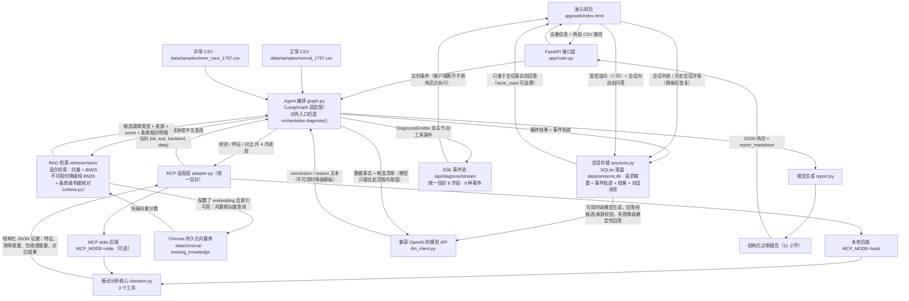
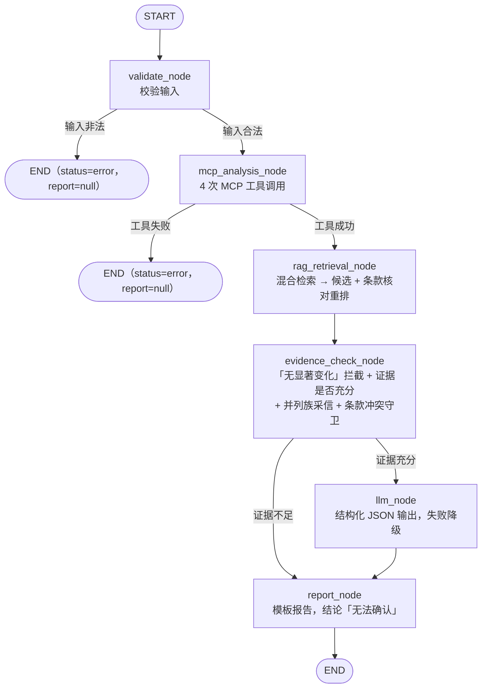

# 工业设备故障诊断 Agent 工作台 · 架构说明

本文说明工作台各层的职责边界、数据流向、一次诊断的真实执行顺序，以及 LangGraph 编排图、SSE 事件流、会话受控追问与会话内自由问答、两个工具后端切换与包络解调的必要性。文中的默认值全部取自 `app/config.py`，行为描述对应仓库现有代码；项目定位是部门内部的数据分析提效工作台，不代表生产级诊断系统。

## 一、各层职责边界

这套设计最重要的分工是：**MCP 只算可复现的信号证据、向量库只存知识向量、RAG 只提供故障类型与公开来源、Agent 只决定调用顺序与组织证据、LLM 只负责理解与表达**。**不让大模型替代信号分析算法**——故障频率是否对得上、频带能量涨了多少，全部由 `numpy/scipy` 计算并固化成 JSON 字段，模型只能在这些字段之上组织语言，不能改写数值、不能引入候选之外的故障类型。

| 模块 | 负责什么 | 不负责什么 |
|---|---|---|
| **MCP 振动分析服务**（`app/mcp/vibration.py`、`app/mcp/server.py`） | 读取 `timestamp,amplitude` / `amplitude` 两种 CSV；数据校验（格式、列、缺失值、长度、采样率、可比性）；时域与频域特征（RMS、峰值、峭度、波峰因子、主频及其幅值、频带能量、频谱峰列表）；包络解调（共振带滤波 → Hilbert 包络 → 包络谱 → 特征频率能量与峰位对齐）；正常与异常对比；按轴承几何换算 BPFO/BPFI/BSF/FTF。纯 `numpy/scipy`，无网络依赖，同一输入必然得到同一输出 | 不给出任何故障名称与结论；不检索知识；不调用大模型；不做严重程度分级 |
| **MCP 适配层**（`app/mcp/adapter.py`） | 对上层提供 `validate_vibration_data` / `extract_vibration_features` / `compare_normal_abnormal` 三个固定契约函数；屏蔽 `local` 与 `mcp:stdio` 两种后端的差异；把结果统一包成信封；任何失败都转成结构化错误、绝不抛异常 | 不做信号计算；不解释、不改写工具返回的数据 |
| **向量库**（Chroma，`app/rag/ingest.py`、`app/rag/store.py`） | 把知识条目正文按「单块 ≤500 字符、相邻块重叠约 80 字符」切分并持久化到 `data/chroma/`（集合默认 `bearing_knowledge`，目录已加入 `.gitignore`）；提供向量相似度查询（余弦距离换算成相似度） | 不参与信号计算；不单独下结论；**未配置 embedding 时完全不被使用**（检索直接走 BM25），也不会发起任何网络请求 |
| **RAG 知识库**（`app/rag/`） | 加载带来源与定位、且带**具名判据条款**的知识条目（`knowledge/*.md` 的 front-matter）；把设备信息与对比证据拼成中文查询；**默认 BM25；混合检索需显式启用，失败退回 BM25**；按阈值过滤；用确定性判据核对引擎逐条比对条款与本次数据，按 `alignment_score = score × 判据因子` 重排；返回候选 `fault_type`、命中特征、来源、`score` 与条款核对明细 | 不做信号计算；不判定故障，只给候选；不生成结论与报告文本；条款只核对「与本次数据是否一致」，不做数值换算 |
| **Agent 编排**（`app/agent/graph.py` + `app/agent/orchestrator.py`） | 用 **LangGraph 固定图**（6 个节点 + 条件分支）校验请求；决定工具调用顺序与次数；把特征、对比、候选组装成模型上下文（含条款核对结果，模型只能引用不能改写）；判断证据是否充分；**首位候选判据与数据冲突时不采信、发复核告警并下调置信度**；决定走模型还是模板；汇总最终输出与 `trace`（后端、工具调用次数、检索方式、节点访问顺序、条款核对摘要、冲突结果、耗时、警告） | 不自己算特征；不自己判定故障类型（只能从 RAG 候选里选）；不自己核对判据（核对由 `app/rag/criteria.py` 完成）；不负责报告文本渲染 |
| **LLM**（`app/agent/llm_client.py`） | 以兼容 OpenAI 协议的方式调用模型（`chat.completions`）；超时、重试与各类异常归一成 `LLMError`（`llm_unavailable` / `llm_timeout` / `llm_error`）；未配置 Key 时立即返回、不发起网络请求 | 不做信号计算；不做检索；不决定流程；不产出报告结构 |
| **报告生成**（`app/agent/report.py`） | 确定性生成 11 个小节的报告结构，区分「数据事实」「知识依据」「推断结论」；第 5 节含候选表（带 `alignment_score`）与**条款核对表**（命中 / 未命中 / 未核对 + 实测值与期望值 + locator）；冲突时把置信度强制下调为 low 并追加人工复核建议；渲染 Markdown；无候选时输出「无法确认」；每条主要判断关联知识来源 | 不新增知识库里没有的故障类型；不计算任何数值；不检索；不调用模型 |
| **FastAPI 接口层**（`app/main.py`） | 只做接口层的事：HTTP 请求的接收与响应组装（健康检查、样本列表、诊断提交、SSE 事件流、会话列表与历史会话恢复、会话追问、会话内自由问答）、字段校验与协议转换，然后转发给 Agent 编排层 | 不参与信号分析、知识检索与结论生成，诊断逻辑不写在接口层 |
| **事件与会话**（`app/agent/events.py`、`app/agent/sessions.py`） | `DiagnosisEmitter` 在图执行到各节点/工具处发射真实事件（SSE 与会话记录共用）；每次诊断保存为会话（请求摘要、事件轨迹、最终结果、对话消息），**落盘在 SQLite（`data/sessions.db`），服务重启不丢**，超过容量上限 50 个时淘汰最旧的会话及其消息；受控追问只允许 7 个固定问题、回答只从会话事实拼装；自由问答可用时调模型（提示词带最近几轮对话），回答经候选白名单与会话来源两道校验，失败降级为确定性回答 | 不改写诊断结果、不重新计算、不引入会话外知识与候选外故障类型 |

## 二、系统架构与数据流



图里三条主数据流分别是：**正常/异常 CSV 输入**（网页或接口下发，落到 MCP 工具）、**结构化 JSON 证据**（工具的原始输出，只读不改写）、**候选故障类型**（RAG 产出，是模型可选答案的封闭集合）。

### Agent 编排的 LangGraph 固定图

编排层用 LangGraph 的 `StateGraph` 把上面的流程显式画成一张**固定图**（`app/agent/graph.py`），而不是让模型自由决定「下一步调哪个工具」。图只有 6 个节点和 3 条条件路由：



- **状态**：`DiagnosisState(TypedDict, total=False)`，各节点读写同一份字典（请求参数、工具证据、RAG 候选、模型结果、`trace` 等），节点的返回值被合并回状态。
- **边的类型**：`validate_node → mcp_analysis_node → rag_retrieval_node → evidence_check_node` 是固定边；`evidence_check_node` 之后是唯一的业务条件分支（证据不足直接到 `report_node`，证据充分先经 `llm_node`）；`validate_node` 与 `mcp_analysis_node` 的失败路径是错误条件边，直接结束、不产出报告（`report=None`）。
- **没有开放式循环**：整张图最多访问 6 个节点一次，不存在「模型反复决定要不要再调工具」的循环；MCP 工具只能由 `mcp_analysis_node` 通过 `app/mcp/adapter.py` 调用，`MAX_TOOL_CALLS`（默认 8）由编排层的 `_call_tool` 在每次调用前检查并生效（`graph.py`），一次正常诊断实测恰好 4 次工具调用。
- **对外契约不变**：唯一外部入口仍是 `orchestrator.diagnose(request, *, max_tool_calls=None, llm_client=None)`（`app/agent/orchestrator.py` 只做兼容性再导出），签名与原有 13 个响应键（`status` / `error` / `device` / `data_quality` / `features` / `comparison` / `rag` / `candidates` / `report` / `report_markdown` / `sources` / `review_suggestions` / `trace`）逐字未变，另新增 `session_id` 键；同步 `/api/diagnose` 对旧调用方完全兼容，SSE 与追问接口是纯增量。
- **`trace.nodes`**：`trace` 新增 `nodes` 键记录节点访问顺序，实测正常路径为 `["validate_node", "mcp_analysis_node", "rag_retrieval_node", "evidence_check_node", "llm_node", "report_node"]`；本轮另新增 `criteria_summary`（每候选的 `fault_type` / `state` / 命中 / 未命中 / 未核对 / 已核对 / `factor` / `score` / `alignment_score`）与 `criteria_conflict`（首位候选冲突守卫结果，无冲突为 `null`）；原有 trace 键未改名。

### 条款级判据核对（判据化改造）

RAG 的原始形态只能回答「哪些条目和查询文本像」，回答不了「这条知识写的判据和本次数据到底对得上吗」。本轮把「知识怎么写」和「候选怎么核对」拆开：

- **知识侧（条款化）**：条目 front-matter 新增 `criteria` 列表，每条写成 `id: xxx | claim: 中文判据 | metric: 指标 | op: 比较符 | value: 阈值`（可选 `family` 特征频率族、`order` 转频倍次）。`claim` 给人看，`metric` / `op` / `value` 给机器核对——**受控词表（15 个指标 × 6 个比较符）而不是字符串求值**，无表达式注入，同一条款也不可能两次核对出不同结果。当前 7 个条目共 24 条条款（内圈 6 / 外圈 6 / 滚动体 5 / 保持架 3 / 正常 2 / 不对中 1 / 不平衡 1）。
- **检索侧（粒度下沉）**：`store.py` 额外建一份**条款级 BM25 索引**（只索引条款 `claim`），用来给每个候选挑「该条目内与本次查询最相关的条款文本」，以 `[条款 ID] 判据原文` 前缀拼进候选 `evidence`；条款索引**不参与条目排序打分**，`store.search()` 的 `score` 语义与候选集合逐字不变（混合分数公式仍有测试断言守着）。`retrieve_candidates()` 新增 `comparison` / `features` 入参，在阈值过滤**之后**附加 `criteria_check` 与 `alignment_score`。
- **核对（确定性引擎）**：`app/rag/criteria.py` 把条款 `metric` 映射到本次对比结果的实测值，按 `op` 比较，输出三态——**hit**（成立）/ **miss**（与数据矛盾）/ **unknown**（指标缺失，**不计为矛盾**）；判据因子 `factor = 0.4 + 0.6 × hits / checked`（无可核对指标或条目无条款时 `factor = 1.0`，不罚分）；候选按 `alignment_score = score × factor` 降序重排。**阈值过滤仍按检索分 `score`**，因此接入核对前后候选集合完全一致，变的只是顺序。
- **冲突守卫（不硬停机）**：`evidence_check_node` 检查首位候选，若条款状态为 `conflict`（misses ≥ hits，或一条未命中都没有、全是矛盾），写 `trace.criteria_conflict`、追加 `warning`（`status=review`，`payload.criteria_conflict` 带未命中条款清单），报告层把置信度强制下调为 low，并在复核建议里追加「按条款核对表逐条人工确认（必要时补采数据）后再定论」。模型提示词里附条款级核对结果，声明**只能引用、不能改写**，并要求在 `reasoning` 里说明冲突——这就是「规则能判的规则判 → 规则冲突交受限模型裁量 → 仍不决交人工确认」这条主线，不引入多 Agent 或 ReAct 循环。
- **实测三场景**（`USE_LLM=never` 模板路径，条款状态与排序均由代码算出）：内圈 top1 `inner_race_fault` score 0.4453、6 条条款全部命中（factor 1.0，alignment 0.4453），第二名 `outer_race_fault` 4 hit / 2 miss（factor 0.8，0.3986 → 0.3189）；外圈 top1 `outer_race_fault` 6/6 命中（0.4412），同场景 `ball_fault` 1 hit / 3 miss（**conflict**，factor 0.55，0.3974 → 0.2186 沉到末位）；滚动体 top1 `ball_fault` 5/5 命中（0.6283）。三场景 top1 与 CWRU 真实标签一致。
- **局限（如实说明）**：条款量小（24 条）且指标词表固定，覆盖不了所有工况；`unknown` 不罚分，指标缺失时核对强度会变弱；条款核对只证明「知识条目写的可核对条件与本次数据一致」，**不能替代物理层面的复核**，也不构成准确率结论。

### 事件流、会话、受控追问与自由问答（体验改造）

**事件发射（P1）**：`run_diagnosis()` 接受可选的 `emitter`（`DiagnosisEmitter`）。图在每个节点与工具的执行点调用 `_emit()` / `emitter.emit()` 发射事件：节点开始/完成、工具开始/完成（含失败摘要）、工具重试、检索降级、模型回退、分支选择、诊断开始/完成/失败。`emitter=None` 时同步路径零开销；发射异常被吞掉，**事件系统永远不影响诊断本身**。

- **统一信封 9 字段**：`{session_id, event, node, tool, status, label, summary, elapsed_ms, payload}`，9 种事件类型与状态语义见 README 第五节。
- **SSE 接口** `POST /api/diagnose/stream`：把 emitter 的事件逐条转成 `data: <JSON>` 推送，响应头带 `X-Session-Id`。诊断在 FastAPI 后台任务里执行，**客户端中途断开不影响后台跑完**——事件仍写入会话记录，最终结果照常保存，之后可凭会话 id 追问。
- **前端消费**：页面是三栏工作台——**左栏**为垂直卡片目录（8 张卡片，点击切换，同一时刻只显示一张），时间线所在的「执行过程」卡片默认选中，其下是**会话窗口列表**（一次诊断 = 一个会话窗口，可切换查看历史会话，进行中的会话也有占位窗口）；**中栏**为分析输入与所选视图（状态横幅与结论摘要常驻视图上方）；**右栏**为与模型的对话对话框。页面用 `fetch + ReadableStream` 逐块解码，`diagnosis_started` 时预渲染全部 6 个节点（等待态），后续事件只更新状态不增删条目（时间线尺寸稳定）。SSE 意外中断且未收到完成事件时，前端降级为同步 `/api/diagnose`，并用 `trace.nodes` 如实重建时间线（未访问节点显示「等待」、证据不足时 `llm_node` 标「跳过」、`llm_mode=template*` 时标「回退」）。

**会话与追问（P2）**：每次诊断（同步或 SSE）保存为会话：请求摘要、事件轨迹、最终结果与对话消息，**落盘在 SQLite（默认 `data/sessions.db`，可用 `SESSIONS_DB_PATH` 覆盖），服务重启后仍可列出与恢复**；会话数超过上限 50 个时按创建时间淘汰最旧的会话及其消息。`POST /api/sessions/{session_id}/ask` 的契约：

- 问题必须**归一化后前缀匹配** 7 个固定问题之一，否则 400 `question_not_allowed`（`allowed_questions` 返回全部清单）；会话不存在返回 404 `session_not_found`。
- 回答由后端**确定性**从会话保存的事实字段拼装（候选、对比证据、频谱事实、trace），不重新计算、不调用模型；回答里列出 `facts_used`（引用的事实字段）。
- 本次记录撑不起该问题时（如错误会话问「为什么判断为这个故障」），`no_support=true`，答案固定为「当前诊断记录无法支持该结论。」——**追问和诊断主流程一样，不允许无依据结论**。

**会话内自由问答（P4）**：右栏对话框允许自由提问（不限于 7 个固定问题），后端仍把回答限制在同一份会话事实内。`POST /api/sessions/{session_id}/chat` 的契约：

- **上下文摘要**：先把会话结果压缩成一段中文事实摘要（请求条件、候选与分数、关键对比证据、置信等级、trace 摘要），连同 `facts_used` 清单与 `context_scope`（固定说明「仅基于本次诊断会话内记录的事实」）一起返回；错误会话也能回答「错在哪」这类问题（摘要里含错误码与中文原因）。
- **多轮对话**：提示词在事实摘要之外再拼一段「最近对话」（`session_store.history()` 取最近 `CHAT_HISTORY_TURNS`（默认 3）轮、单条超过 400 字符截断），用于理解指代与追问关系；提示词同时声明历史对话不是新的事实来源，依据仍只有会话摘要。因此上下文是有界窗口，不会随对话轮数无限增长。
- **两道校验**：模型回答回来后先做关键词校验——出现知识库已知但**不在本次候选内**的故障类型、或出现**会话来源之外**的 URL，即判 `answer_rejected`，整段回答作废；两道校验都通过才以 `mode=llm` 返回。
- **确定性降级**：未配置模型（`llm_unavailable`）、超时（`llm_timeout`）、调用异常（`llm_error`）或校验未通过（`answer_rejected`）时，走确定性回答——受控问题直答、主题命中（输入/候选/证据/置信/复核）用会话事实拼装，其余问题给出事实摘要并显式声明「无法直接支撑」。`mode=deterministic`，`model_error` 里带降级原因，`status` 不受影响。
- **错误码**：问题为空 → 400 `empty_question`；会话不存在或已过期 → 404 `session_not_found`；两者都带中文原因。回答无依据时 `no_support=true`，答案与追问共用同一句「当前诊断记录无法支持该结论。」
- **消息落盘**：追问与自由问答的每轮问答都写进会话消息表（`role` / `content` / `meta`，`meta.kind` 区分 `ask` 与 `chat`），既作为下一轮上下文，也让刷新页面后右栏对话区能原样恢复。

**会话落盘存储层**：`SessionStore`（`app/agent/sessions.py`）用单个 SQLite 文件（默认 `data/sessions.db`，`SESSIONS_DB_PATH` 可覆盖）承载两张表——`sessions`（`session_id` 主键、`created_at`、请求摘要、最终结果、事件轨迹，后三者按 JSON 文本存储）与 `messages`（自增主键、`session_id`、`created_at`、`role`、`content`、`meta`，并建 `(session_id, id)` 索引）。

- **写入**：诊断结束由 `save()` 一次性落盘（`INSERT OR REPLACE` + 容量淘汰），追问 / 自由问答各自 `append_message()`。
- **恢复**：`GET /api/sessions` 返回按创建时间倒序的会话摘要（含 `status` / `conclusion` / `confidence_level` / `message_count`），`GET /api/sessions/{session_id}` 返回单会话的完整记录（结果、事件轨迹、全部消息）；前端用事件轨迹重放时间线、按 `meta.kind` 还原历史对话，然后可在同一会话里继续提问。
- **容量与并发**：仍以 50 个会话为上限，超出后按创建时间淘汰最旧会话及其消息；自由问答跑在 `asyncio.to_thread` 里，连接以 `check_same_thread=False` 打开，全部读写由 `threading.Lock` 串行化，单进程内安全。

## 三、一次诊断的执行顺序与失败处理

`orchestrator.diagnose()`（内部即上面那张 LangGraph 固定图）的顺序是固定的，每一步失败都会直接停止并在 `error.code` 里给出原因，不会带着不完整的证据继续往下走。下表第 2~5 步都在 `mcp_analysis_node` 内完成，第 6 步是 `rag_retrieval_node`，第 7 步是 `evidence_check_node` + `llm_node` + `report_node`。

| 顺序 | 节点 | 步骤 | 真实动作 | 失败处理 |
|---|---|---|---|---|
| 1 | `validate_node` | 校验输入 | 检查 `normal_path`、`abnormal_path` 是非空字符串，`sampling_rate`、`rotation_speed` 是有限正数 | 不通过则 `status=error`、`error.code=invalid_argument`，**流程不开始、不调用任何工具** |
| 2 | `mcp_analysis_node` | `validate_vibration_data` | 第 1 次工具调用；返回 `checks / errors / warnings / valid / comparable` | 工具失败（信封 `ok=false`）直接停止，返回该工具的错误码（如 `file_not_found`、`file_format`、`empty_data`）；工具成功但 `valid` 或 `comparable` 为 `false` 也停止，返回 `errors` 里第一条的错误码（如 `missing_value`、`insufficient_data`、`sampling_rate_mismatch`、`incomparable_length`） |
| 3 | `mcp_analysis_node` | `extract_vibration_features`（正常样本） | 第 2 次工具调用；传 `rotation_speed` 因而附带包络解调，另传 `include_series=True` 取回曲线序列与 WAV | 工具失败即停止，返回该工具错误码（如 `insufficient_data`、`invalid_argument`） |
| 4 | `mcp_analysis_node` | `extract_vibration_features`（异常样本） | 第 3 次工具调用；参数同上 | 同上 |
| 5 | `mcp_analysis_node` | `compare_normal_abnormal` | 第 4 次工具调用；输出特征变化、频带能量变化、主频迁移、证据列表、包络谱特征频率能量与对照 | 工具失败即停止，返回该工具错误码（如 `missing_value`） |
| 6 | `rag_retrieval_node` | RAG 检索 | 不是 MCP 工具，**不计入工具调用次数**；先 `build_query` 拼查询，再 `retrieve_candidates` 用混合检索取 `top_k=5`、按阈值 `0.35` 过滤（见下节） | 检索本身不抛异常（异常时自动降级 BM25）；无候选时置 `insufficient_evidence` |
| 7 | `evidence_check_node` → `llm_node` → `report_node` | 判断证据 + 汇总候选 + 生成报告 | `evidence_check_node` 先做「无显著变化」拦截（无显著变化特征、所有特征变化倍数 <0.3 且主频未迁移），再判断候选是否为空；若包络谱特征频率族并列，`_tied_family_resolution()` 仅在检索首位候选声明的 `frequency_family` 落在并列族内时采信该候选、继续出结论（置信度由报告下调为 low），族不匹配或条目未声明族时仍按证据不足处理；证据充分才进 `llm_node` 调模型，最后由 `build_report` 确定性组装结构、`render_markdown` 渲染 Markdown | 证据不足 → 直接到 `report_node`，`status=insufficient_evidence`，结论写「无法确认」且 `candidates`/`sources` 均为空；模型各类失败 → 降级模板并写 `trace.warnings`，`status` 仍为 `ok` |

从 `app/config.py` 读到的真实默认值如下（都可被同名环境变量覆盖）：

| 参数 | 默认值 | 说明 |
|---|---|---|
| `MAX_TOOL_CALLS` | **8** | 单次诊断允许的最大工具调用次数；正常一次诊断固定消耗 4 次 |
| `MCP_MAX_RETRIES` | **1** | MCP 工具基础设施类错误的有限重试次数，重试不占 `MAX_TOOL_CALLS` 配额 |
| `CANDIDATE_GAP_THRESHOLD` | **0.05** | 前两名候选分数差小于该值时触发频率证据复核（`trace.frequency_review`） |
| `MIN_SIGNAL_DURATION` | **0.25** 秒 | 异常信号时长低于该值时按数据不足处理，停止强行诊断 |
| `LLM_TIMEOUT` | **20.0** 秒 | 单次模型调用超时 |
| `LLM_MAX_RETRIES` | **1** | 模型重试次数，即最多尝试 2 次（SDK 层 `max_retries=0`，避免重复叠加） |
| `RAG_TOP_K` | **5** | 检索返回的候选条数 |
| `RAG_SCORE_THRESHOLD` | **0.35** | 候选相似度阈值，低于该值不计入候选 |
| `RAG_VECTOR_WEIGHT` / `RAG_BM25_WEIGHT` | **0.6** / **0.4** | 混合检索中向量分与 BM25 分的权重，见下节 |
| `RAG_CHUNK_SIZE` / `RAG_CHUNK_OVERLAP` | **500** / **80** | 知识切分的单块最大字符数与相邻块重叠字符数 |
| `CHROMA_DIR` / `CHROMA_COLLECTION` | `data/chroma` / `bearing_knowledge` | 向量索引持久化目录与集合名 |
| `SESSIONS_DB_PATH` | `data/sessions.db` | 会话与对话消息的 SQLite 落盘路径，服务重启不丢 |
| `CHAT_HISTORY_TURNS` | **3** | 自由问答提示词带进的最近对话轮数（1 轮 = 用户问 + 助手答），单条超 400 字符截断 |
| `AUDIO_DIR` | `data/audio` | 原始波形 WAV 旁挂目录，文件名 `<session_id>_<slot>.wav` |
| `AUDIO_MAX_FILES` | **200** | WAV 旁挂文件保留上限，超出按修改时间淘汰最旧的 |
| `MCP_MODE` | **local** | 工具后端，见第五节；公开演示默认使用进程内调用 |
| `ENABLE_HYBRID_RETRIEVAL` | **false** | 真实 embedding 评测通过后才开启向量 + BM25 混合检索 |
| `MODEL_NAME` / `EMBEDDING_MODEL` | `gpt-4o-mini` / `text-embedding-3-small` | 模型与向量模型名 |
| 适配层单次 MCP 调用超时 | **60.0** 秒 | `adapter._MCP_TIMEOUT_SECONDS`，连接 + 调用 + 断开的总时长 |

四条必须写清楚的约束：

- **工具调用上限**：`call_tool` 在每次调用前检查 `trace["tool_calls"] >= limit`，达到上限即停止并返回 `error.code=max_tool_calls_exceeded`，不产生任何诊断结论。正常流程只用到 4 次，远低于默认的 8 次；把上限调成 2，就会在第 3 次调用（异常样本特征提取）前停止，返回 `max_tool_calls_exceeded`。
- **P3 自适应守卫（体验改造新增，全部证据驱动，不改候选白名单与结论约束）**：① 工具失败**有限重试**——只重试基础设施类错误（`mcp_connection_error` / `mcp_timeout` / `mcp_protocol_error` / `internal_error`），按 `MCP_MAX_RETRIES`（默认 1）重试且**不占工具调用配额**，重试过程发射 `warning(status=retrying)` 事件；数据内容错误（`missing_value` 等确定性失败）重试无意义，直接停机。② **数据不足守卫**——异常信号时长低于 `MIN_SIGNAL_DURATION`（默认 0.25 秒）时按证据不足处理，停止强行诊断并给补充数据建议。③ **候选分数接近复核**——前两名候选分数差小于 `CANDIDATE_GAP_THRESHOLD`（默认 0.05）时，用包络谱主导成分与谱峰对齐结果做频率证据复核，写入 `trace.frequency_review` 并附人工复核建议。④ **时/频证据冲突提示**——时域特征明显变化而频域无变化（或反之）时提示人工复核，写入 `trace.evidence_conflict`。以上守卫只新增 trace 键与告警事件，不改变候选白名单与结论约束。
- **模型超时重试与降级**：模型被要求返回结构化 JSON（`{"selected_fault_type", "summary", "reasoning", "review_suggestions"}`），其中 `selected_fault_type` 必须是候选里的某个 `fault_type` 或 `unconfirmed`。未配置 `MODEL_API_BASE` / `MODEL_API_KEY`（`settings.llm_available` 为 `false`）或 `USE_LLM=never` 时直接用模板报告、`llm_mode="template"`；调用超时或失败、返回内容不是合法 JSON、`selected_fault_type` 不在候选集合（含 `unconfirmed`）内，这三种情况都**降级为模板报告**（`llm_mode="template_fallback"`）并把原因写进 `trace.warnings` / `trace.llm_error`，不中断整个流程。模板报告的字段结构与接真实模型时逐字段一致，模型只影响 `conclusion` 与 `inferences` 的措辞。
- **RAG 无结果不强行下结论**：阈值过滤后候选为空即视为证据不足，Agent 置 `status=insufficient_evidence` 并**跳过模型诊断**，报告结论输出「无法确认」，来源列表为空。即使模型可用，其给出的故障类型也必须落在候选集合或 `unconfirmed` 之内，否则整条模型结果被丢弃（回到模板）。这条约束的实际效果是：**模型永远不会成为故障类型的来源**。

### 曲线序列与波形音频（本轮新增）

前端要画「原始 vs 异常」的时域波形、幅度谱、包络谱，还要能试听原始波形，但这两件事都不能破坏既有约束——**不新增第 5 个 MCP 工具**（否则「固定 4 次工具调用」与 `trace.tool_calls` 断言全部失效），**也不把 PCM 塞进诊断响应或 SQLite**。方案是把两者挂到已有的第 2、3 次工具调用上：

| 环节 | 实现 | 关键约束 |
|---|---|---|
| 取回曲线 | `extract_vibration_features` 新增**可选**入参 `include_series`（默认 `false`）。为 `false` 时返回结构与旧版逐字一致；编排层固定传 `true`，`features` 因此多一个 `series` 块 | 参数经 `adapter` 双路径透传：`local` 直传位置参数，`stdio` 只在为真时写入 `include_series`，避免污染旧契约 |
| 波形序列 | `waveform`：把整段信号分成 600 个桶，每桶取 min / max，画出上下包络 | **分桶而非等间隔抽点**，否则 1 秒 12000 点抽到 600 点会丢掉冲击尖峰 |
| 幅度谱序列 | `spectrum`：全谱抽 600 点 | 抽点规则是**峰值保序**——每桶取幅值最大的 bin，等间隔抽点会把 BPFO/BPFI/BSF 这些窄峰抽没 |
| 包络谱序列 | `envelope`：先裁到 **0~1000Hz** 再抽 400 点 | 裁带是因为 BPFI 3 阶也只有约 486Hz，全谱到 6000Hz 等于把有效信息压缩掉九成；裁带后仍按峰值保序抽点 |
| 音频 | `audio`：单声道 16bit PCM WAV（`wave` 模块写 BytesIO），按**全局峰值归一化**到 0.98 满量程；以 base64 随工具结果回到编排层，**由编排层 `pop` 出来落盘** | 响应体与数据库里只剩元数据与 `available` 标记，**任何一处都不含 `wav_base64`**（有测试断言整份响应 JSON 不含该字段） |
| 落盘与清理 | 编排层写 `AUDIO_DIR/<session_id>_<slot>.wav`，写成功置 `audio["available"]=true` 并调用 `_prune_audio()` 按修改时间保留最新 `AUDIO_MAX_FILES` 个；写失败只追加一条 `trace.warnings`，不影响诊断 | 落盘异常（`OSError` / `ValueError` / `binascii.Error`）不回滚诊断，前端降级为「无可播放音频」 |
| 试听 | `GET /api/sessions/{session_id}/audio/{slot}.wav`（`FileResponse`，`audio/wav`），前端用 `<audio preload="none">` 懒加载 | `slot` 只认 `normal` / `abnormal`，`session_id` 需匹配 `[A-Za-z0-9_-]{6,64}`，否则 404 `audio_not_found`，不做路径拼接 |

两点口径必须写清楚：序列取自**去均值后**的分析信号（与 RMS / 峭度同口径，所以波形纵向是围绕 0 的），WAV 也是这路信号的按峰值归一化重放。因此**听感只用于辅助判断冲击与调制形态，不参与打分、也不是诊断依据**。损坏样本在数据校验阶段就停机，`features` 里既没有 `series` 也没有音频，`tool_calls` 仍为 1。

## 四、混合检索与持久化向量库

RAG 检索支持三种运行模式，由 `KnowledgeStore.retrieval_mode` 表达，`/health` 直接透出这个值，**取值只可能是 `hybrid` 或 `bm25`**：

| 模式 | 触发条件 | 实际行为 |
|---|---|---|
| `hybrid` | 显式设定 `ENABLE_HYBRID_RETRIEVAL=true`、配置了 embedding，且 Chroma 索引可打开 | 向量分数与 BM25 分数加权融合后排序 |
| `bm25` | 未开启混合检索或未配置 embedding | 纯词权重检索，检索本身不发起网络请求 |
| `bm25`（降级） | 配置了 embedding，但索引不可用（目录/集合不存在）、或向量/embedding 调用抛异常 | 与上一种模式同样走 BM25，但 `store.degraded=True`，并给出 `degraded_reason`，该原因被追加进 `trace["warnings"]`，**不中断诊断** |

**融合公式**：`final_score = RAG_VECTOR_WEIGHT * vector_score + RAG_BM25_WEIGHT * bm25_score`，即默认 `0.6 * 向量分 + 0.4 * BM25 分`。两个分数在融合前各自归一化到 `[0, 1]`（向量分由 Chroma 余弦距离换算为 `1 - distance`，BM25 分先按固定系数 `_BM25_SCALE = 2.5` 放大再裁剪），融合结果同样裁剪到 `[0, 1]`。同一条知识条目命中多个文本块时只保留最高分块，然后继续用 `RAG_SCORE_THRESHOLD`（默认 `0.35`）过滤。

**为什么是 0.6 / 0.4**：向量分负责语义相近，BM25 分负责术语精确匹配（本项目查询文本里大量出现 `BPFI`、`2×BSF`、`包络谱` 这类专有词，这是 BM25 的强项），因此向量权重略高于词权重，但两者都不为 0，避免任何单一分支失效时结果整体崩掉；两个权重都可用环境变量覆盖，也可通过降级路径完全退化为纯 BM25。

**Chroma 持久化的位置与重建方式**：

- 索引默认持久化在 `data/chroma/`（`CHROMA_DIR` 可覆盖），集合名默认 `bearing_knowledge`（`CHROMA_COLLECTION` 可覆盖），该目录**已加入 `.gitignore`**。写入走 `PersistentClient` + `get_or_create_collection`（余弦空间、关闭匿名遥测）。
- 知识切分按「单块 ≤ `RAG_CHUNK_SIZE`（500）字符、相邻块重叠约 `RAG_CHUNK_OVERLAP`（80）字符」，块 ID 稳定可复现（形如 `inner_race_fault#chunk-000`），每个块携带 `fault_type` / `title` / `source` / `source_url` / `locator` / `document` / `chunk_id` 元数据。实测 7 个知识条目切成 **14 个文本块**，块正文最大 **499** 字符，相邻块重叠实测 **79** 字符。
- **重建命令**（在项目根目录执行）：`& ".\.venv\Scripts\python.exe" -m app.rag.ingest --rebuild`（幂等：稳定块 ID + `upsert`，并清理已不存在的旧块），查看现状用 `--status`；两者都支持 `--knowledge-dir` / `--chroma-dir` / `--collection`。
- **重建前提**：重建依赖 embedding 服务；索引应与当前模型、维度和知识条目一致。更换配置后重建，并独立验证召回，不能仅凭索引存在就启用。
- **验证边界**：假 embedding 测试只覆盖机制。实际混合检索试运行中外圈样例出现 `normal` 排首位的问题，因此公开演示默认 BM25，混合检索尚未通过质量验收。

## 五、两个工具后端：`MCP_MODE=local` 与 `MCP_MODE=stdio`

`MCP_MODE` 默认是 `local`，由适配层 `describe_backend()` 决定走哪条路径。

- **`MCP_MODE=stdio`（可选）→ `mcp:stdio`**：`_server_parameters()` 取 `MCP_SERVER_CMD`（留空则用当前解释器 + `app/mcp/server.py`），通过官方 `mcp` SDK 的 `stdio_client` 启动子进程，**每次调用建立一次连接**（初始化 → `call_tool` → 断开，单次总超时 60 秒，演示项目不做连接池）。返回的 `CallToolResult` 需要带布尔字段 `ok`，适配层校验后才解出 `data`。
- **`MCP_MODE=local` → `local`**：用 `asyncio.to_thread` 在进程内直接调用 `app/mcp/vibration.py` 的同步函数，不启子进程、不走协议。

两条路径最终都返回同一个信封：

```
成功 {"ok": true,  "tool": <工具名>, "backend": <后端>, "data": {...}}
失败 {"ok": false, "tool": <工具名>, "backend": <后端>,
      "error": {"code": "...", "message": "...", "field": null}}
```

编排层只读信封的 `ok` / `data` / `error`，不关心 `backend` 字段。这样设计的意义在于：**替换正式 MCP 实现时，只需要改适配层的后端实现**（`_server_parameters` / `_call_mcp` 或新增一个后端分支），上层 Agent 编排与报告层零改动，契约和信封结构都保持不变。实测同一内圈用例下，`envelope` 与 `comparison` 两个结果在 `local` 与 `stdio` 两种后端下逐字段完全一致。

### `MCP_SERVER_CMD` 的解析规则（路径含空格已支持）

`MCP_MODE=stdio` 时，适配层用 `parse_server_command` 把 `MCP_SERVER_CMD` 解析成 argv，三条规则按顺序判断：

1. **JSON 字符串数组**（路径含空格或反斜杠时最稳妥）：例如 `["C:\\Program Files\\Python\\python.exe", "-m", "app.mcp.server"]`，整体按 JSON 解析，每个元素原样作为一个 argv，不再二次切分。
2. **普通命令行字符串**：可执行文件用引号包住即可，**路径允许含空格**，例如 `"C:\path with space\.venv\Scripts\python.exe" -m app.mcp.server`。切分用 `shlex.split(posix=False)`——该模式不启用转义符，**Windows 路径里的反斜杠不会被当成转义符吃掉**，切分后只再去掉包裹引号。
3. **空值** → 回退为「当前解释器 + `app/mcp/server.py`」的原有默认行为。

解析或启动失败（JSON 非法、引号不配对、可执行文件不存在等）返回结构化错误 `invalid_server_command`，不抛裸异常。**实测**：把 `MCP_SERVER_CMD` 设为「引号包含含空格的 venv python 路径 + `-m app.mcp.server`」，真实走通 `mcp:stdio` 后端并成功调用工具（本项目根目录本身含空格，因此这条路径是真实可验证的）。

## 六、包络解调为什么必要

**原始幅值谱不够用。** CWRU 的特征频率都落在低频段：转频 29.95Hz、FTF 11.929Hz、BSF 70.584Hz、BPFO 107.364Hz、BPFI 162.186Hz。而轴承局部缺陷的冲击能量主要被激励到轴承与结构的高频共振带上，直接在原始幅值谱上取这些特征频率处的能量，**异常与正常的能量比全部小于 1**——也就是说异常样本在这些频点上并不比正常样本高，没有区分度。

**做法**（`vibration._bandpass` / `_envelope_analysis`）：先在共振带上带通滤波，默认取奈奎斯特频率的 **0.33~0.83 倍**（12kHz 采样下约 2~5kHz），4 阶巴特沃斯带通 + `filtfilt` 零相位滤波（也可用 `envelope_band` 入参指定）；再对带通信号取 `|hilbert(x)|` 得到包络并去均值；然后加汉宁窗做 rFFT 得到包络谱（归一方式与幅值谱一致）；最后在 `ftf/bsf/bpfo/bpfi` 的 1、2、3 阶谐波处按 ±3%（且不小于频率分辨率）窗口累加幅值平方，并把包络谱局部极大值与这些频率对齐，记录最近峰位与偏差。换到包络谱之后，样本的区分度就出来了：

| 内置样例（fs=12000、1797rpm） | 包络谱中能量最高的特征频率 | 端到端结果 |
|---|---|---|
| 内圈样本 | BPFI 处 **1.51e-2**，为各特征频率中最高（基线未检出），BPFI 及其谐波处出现明显峰 | `inner_race_fault`，score 0.4453，条款核对 6/6 命中，status=ok |
| 外圈样本 | BPFO 处 **2.49e-1**，为各特征频率中最高 | `outer_race_fault`，score 0.4412，条款核对 6/6 命中，status=ok |
| 滚动体样本 | BPFI **4.20e-4** 与 BSF **3.93e-4** 仅差约 7%，低于量级余量阈值 | 检索首位 `ball_fault`（0.6283，条款核对 5/5 命中，`frequency_family=BSF`）落在并列族内 → 采信该候选、置信度 low |
| 外圈场景的滚动体条目 | 该条目声明的判据（轻微峭度变化、包络能量分散等）与本次外圈数据不符 | 条款核对呈 **conflict**（1 命中 / 3 未命中），`alignment_score` 由 0.3974 压到 0.2186，排到末位 |

**局限也要说清楚**：共振带是按奈奎斯特频率**固定比例**选取的，没有用谱峭度 / kurtogram 自适应选带，共振带选偏时包络谱的信噪比会下降；滚动体样本说明 **7% 量级的能量差不足以支撑排他性判断**，因此 `dominant_characteristic` 已加入**量级余量判据**（`_DOMINANT_MARGIN_RATIO = 1.15`，最高/次高相差不到 15% 时不宣称「最突出」，改输出 `tied_candidates` 并列候选），并列时**只有当检索首位候选声明的 `frequency_family` 落在并列族内才采信该候选**，本轮据此把滚动体场景的检索首位修正为 `ball_fault`（0.6283）、置信度下调为 low；但并列本身未消除、结论不代表主导族已确定，采信依赖条目 `frequency_family` 元数据，弱冲击信噪比与固定比例选带这两个根因未动（详见 `docs/evaluation.md` 第五节）。

补一句口径说明，避免数字看起来对不上：本节引用的 RMS 是**原始信号（未去均值）**的实测值，正常 0.0741、内圈 0.2893、外圈 0.6764、滚动体 0.1383；而工具输出的是**去均值后**的 RMS，示例报告里因此显示为 0.0732 与 0.2889。两者定义不同，不是同一口径。

## 七、已知局限

- **混合检索质量未通过验收**：实际试运行出现外圈样例排序异常。当前默认关闭混合检索，假 embedding 测试只覆盖实现机制，真实语义召回需独立评测。
- **两条检索分支的分数标定方式不同**：向量分支是归一化后的余弦相似度，BM25 分支是词权重点积再乘固定系数（`_BM25_SCALE = 2.5`）放大到可比量级，两者都裁到 `[0, 1]`，但**阈值 `0.35` 对两条分支的含义并不严格等价**；`0.6 / 0.4` 的融合权重同样是工程取值，没有做离线召回评测来调优。
- **Docker 化未真实验证**：仓库提供 `Dockerfile` 与 `.dockerignore`，但本机未安装 Docker（`docker --version` 报命令不存在），**镜像既未真实构建、也未启动容器验证 `/health`**，只做了静态检查。
- **会话存储为单机 SQLite 文件**：会话与对话消息持久化在 `data/sessions.db`（单文件、无服务进程），服务重启不丢，超过 50 个按创建时间淘汰；但**多副本部署不共享**，会话与事件都不跨进程同步。
- **多轮上下文是有界窗口**：自由问答只带最近 `CHAT_HISTORY_TURNS`（默认 3）轮对话、单条截断 400 字符，更早的对话不进入提示词；历史对话仅用于理解指代，事实依据仍只有本次会话摘要。
- **SSE 单机直连**：`/api/diagnose/stream` 是单进程内的事件直推，没有经过任何消息中间件；多副本部署时事件与会话都不跨进程共享，生产化需要引入外部队列与共享存储。
- **频率分辨率受限于采样时长**：分辨率 = `fs / N`，1 秒数据即 1Hz，因此 BPFI 实际落在 **162.0Hz** 而不是理论值 162.186Hz（报告里偏差 0.11% 即来自这里）。
- **`bsf` 的对外口径已与知识库对齐**：`characteristic_energy["bsf"]` 累加的是 1/2/3 阶谐波（70.58 / 141.17 / 211.75 Hz，**已覆盖 2×BSF**），对外输出的 `characteristic_frequencies` 现在**同时给出 `bsf`（1×BSF = 70.5838Hz）与 `bsf_2x`（2×BSF = 141.1676Hz）**，查询文本也会写入 2×BSF。口径对齐消除了一个成因；本轮进一步靠知识库判据表达与 `frequency_family` 元数据把滚动体条目顶到检索首位（`ball_fault` 0.6283，置信 low），但并列未消除、结论不代表主导族已确定，弱冲击信噪比这一根因未动（见 `docs/evaluation.md` 第五节）。
- **工况与样本量都单一**：只覆盖 12k 驱动端 / 0 hp / 1797rpm 一种工况，每个样本只有 1 秒（12000 点）；变转速、变负载与更长时长的表现都未验证。
- **共振带固定**：见第六节，未使用谱峭度 / kurtogram 自适应选带。
- **曲线与音频是有损可视化，不参与判据**：波形是 600 桶 min/max 包络、幅度谱 600 点、包络谱 0~1000Hz 400 点，都是给前端画图用的降采样结果；抽点规则虽然保证特征频率峰被保留，但它**不是完整数据**，也不参与任何特征计算或打分。音频按峰值归一化、且是去均值信号的重放，只能听冲击/调制形态。
- **音频旁挂文件是单机本地盘的**：`AUDIO_DIR` 落在本地文件系统，多副本部署不共享；且按 `AUDIO_MAX_FILES`（默认 200）淘汰最旧的旁挂文件，被淘汰的旧会话再打开「信号分析」卡片时播放器会拿到 404（页面按「无可播放音频」降级，诊断结果本身不受影响）。
- **条款核对是「知识写的条件 vs 本次数据」的核验，不是物理结论**：知识库目前只有 24 条条款、指标词表 15 项，覆盖不了所有工况与故障形态；`unknown`（指标缺失）不罚分，指标缺失时核对强度会变弱；冲突守卫只在首位候选条款矛盾时下调置信度并要求人工确认，**不改变候选集合与阈值口径**；条款措辞与阈值仍来自公开资料的工程化改写，不是现场标定值。
- 输出属于工程辅助建议，不能替代现场复测、拆检与专业人员判断。

外部资料：数据集说明见 `docs/dataset.md` 与 [CWRU Bearing Data Center](https://engineering.case.edu/bearingdatacenter/welcome)；MCP 协议与 Python SDK 见 [Model Context Protocol](https://modelcontextprotocol.io/docs/getting-started/intro) 与 [modelcontextprotocol/python-sdk](https://github.com/modelcontextprotocol/python-sdk)；包络解调用到的 [scipy.signal.hilbert](https://docs.scipy.org/doc/scipy/reference/generated/scipy.signal.hilbert.html)。
